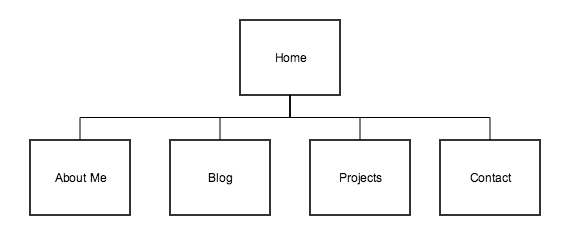

####1. What are the 6 Phases of Web Design?
1. __Information Gathering__: 
2. __Planning__: 
3. __Design__: 
4. __Development__: 
5. __Testing and Delivery__: 
6. __Maintenance__: 

####2. What is your site's primary goal or purpose? What kind of content will your site feature?
The primary purpose of my website is to have something to show potential future employers and other fellow developers who I am, what I have done, provide links to all of my social media accounts, and give a way to contact me. The About Me page will have a short bio description of myself, which will show what my personality is like (and if I would be a good fit with that company's culture). The Projects page would be my portfolio where I would show the projects that I have completed or am currently working on with links to both the website and the GitHub repo. I would also provide a short description about what it does, why I created it, and what role I played in its creation. The blog page would have all of the blog posts that I wrote and will write for DBC (like this!) as well as whatever topic I want to talk about (e.g. UIUX vs SWE, What Are Hackathons?, How To Contribute to Open Source, etc.). The contact page would have a contact form that would have fields for the person's name, email address, subject, and message. All of that information would be sent to me in an email. Links to my LinkedIn and GitHub accounts would be included in the header of each page.

####3. What is your target audience's interests and how do you see your site addressing them?
My target audience's interest is to find out more about myself. This could be to see how experienced I am, what my personality is like, and/or what projects I have worked on. I hope that people will be able to easily find all of the information that they're looking for. In order to make the navigation process as simple as possible, I'll include a navigation bar and have everything be clearly labelled. If they weren't able to find something, the contact page will allow them to ask whatever questions they have.

####4. What is the primary "action" the user should take when coming to your site? Do you want them to search for information, contact you, or see your portfolio? It's ok to have several actions at once, or different actions for different kinds of visitors.
The primary purpose is for users to look at my past projects and resume. This could be to assess my skills to see if they want to continue with a application process with their company, to recruit me, or to ask if I would like to partner with them on a project. If the person that is looking at my website is not a recruiter for a company that I applied to, I would hope that they would go on the contact page and reach out to me expressing interest.

####5. What are the main things someone should know about design and user experience?
People need to understand that design and user experience is not just about HTML, CSS, and making something "pretty". It is about thinking about how the user will interact with the website, how the color scheme will make the user feel, making the layout make sense, etc. People also need to realize that creating a good UIUX is not easy because like back end development, it takes time and patience to get a website to look the way you want it to.

####6. What is user experience design and why is it valuable? 
User experience design (UXD) is all about human-computer interaction (HCI). In other words, it is about creating a design that maximizes user satisfaction. UXD is __very__ important because even if a website has amazing functionality, users are less likely to return or even stay on it if the UXD is not done well.

####7. Which parts of the challenge did you find tedious?
I found that thinking of all the pages that I want on my website and the different contents was a bit challenging. I wanted to make sure that everything was organized and that the order of pages made sense.
