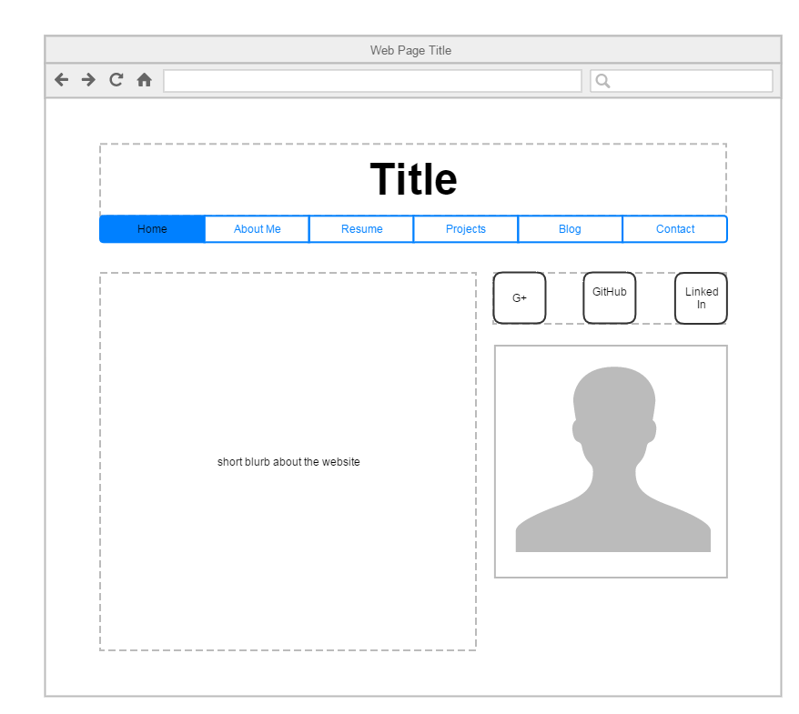
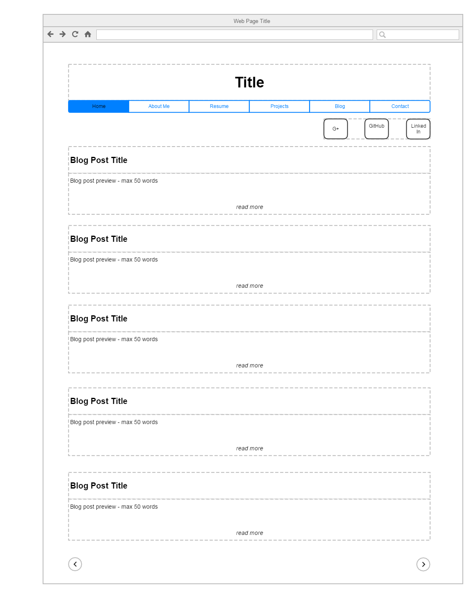

####What is a wireframe?
Wireframing is when you draw out the layout/template of each page type for your website. Wireframes are not detailed, but rather show where everything would go using shapes and labels.

####What are the benefits of wireframing?
Wireframing allows you to quickly draw up a goal template for you site before you start to create it so that you don't waste your time trying to rearrange things with code. since it's a drawing, you it is a quick task that allows the client to approve a design layout before you start to code it.

####Did you enjoy wireframing your site?
I did because I always like going in with a plan. It made it very clear for me to know what I needed to include when drawing the wireframe.

####Did you revise your wireframe or stick with your first idea?
I revised it. I was originally thinking about making the Home Page the About Me section, but thought that it might confuse the user. So, I changed it to have a short blurb of the website and a picture of myself. I also changed the location of the social media links. They were originally in the footer section, but I moved them closer to the top so that they are easily noticed.

####What questions did you ask during this challenge? What resources did you find to help you answer them?
I wondered how users interact with these types of websites and how these websites get noticed on Google. I found out that Google has an extremely complicated algorithm. In order to get ranked higher on their search engine, you need to do something called Search Engine Optimization (SEO). I'm hoping that we'll learn about that later on in DBC.

####Which parts of the challenge did you enjoy and which parts did you find tedious?
I liked the part where I had to actually create the wireframe. I thought that thinking of everything that should be included and thinking of how those components should be layed out were a bit tedious.

