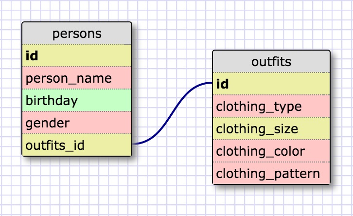

- SELECT * FROM states;
- SELECT * FROM regions;
- SELECT state\_name, population FROM states;
- SELECT state\_name, population FROM states ORDER BY population DESC;
- SELECT state\_name, population FROM states WHERE region\_id=7;
- SELECT state\_name, population\_density FROM states WHERE population\_density>50 ORDER BY population\_density ASC;
- SELECT state\_name FROM states WHERE population BETWEEN 1000000 AND 1500000;
- SELECT state\_name, region\_id FROM states ORDER BY region\_id ASC;
- SELECT region\_name FROM regions WHERE region\_name LIKE "%Central%"
- SELECT regions.region\_name, states.state\_name FROM regions INNER JOIN states ON regions.id=states.region\_id;

____

+ What are databases for?
	> Databases are used to store information. They keep data organized. Database tables can have a one-to-one, one-to-many, or many-to-many relationship. Depending on how you format them, they can also help reduce your program's runtime.

+ What is a one-to-many relationship?
	> A one-to-many relationship means that there is a primary key that can connect to many other items in another table. For example, There is only one canis genus, but there are many types of species within the canis genus such as domestic dogs (canis canis) and there are many breeds of dogs such as English Bulldogs, Shetland Sheepdogs, and Pomeranians.

+ What is a primary key? What is a foreign key? How can you determine which is which?
	> A primary key is a unique ID for a row in a table. A foreign key is a unique number that refers to a primary key in another table.

+ How can you select information out of a SQL database? What are some general guidelines for that?
	> You can select information using a query. The most basic type of query you can build is SELECT * FROM table\_name which selects everything from the table called table\_name. You can even specify which column(s) you want by replacing the * with the column name(s). There are other query commands that allow you to select certain data within the columns, join tables, and even sort the data.

