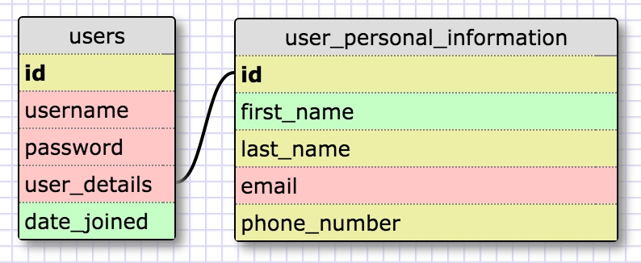
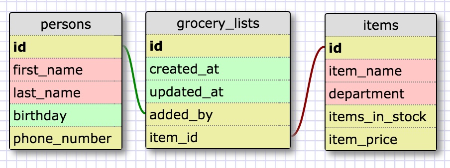

####one-to-one

____

####many-to-many

____

- What is a one-to-one database?
	> A one-to-one database is when you have 2 items that have an exclusive relationship. A simple example of this would be that while there are many phone numbers, only 1 phone number can belong to 1 phone.
	
- When would you use a one-to-one database? (Think generally, not in terms of the example you created).
	> If there is only one instance of a certain thing (e.g. each person is unique), then you would want to put it in its own table to give it a unique ID to make things easier to refer to. For example, a school may have more than one student named Charlie, but each Charlie is unique. To avoid having to search through all of the Charlies, they can simply search for him by his student ID number.
	> You probably won't use many one-to-one databases, but you would want to use them for storing private information for security purposes.

- What is a many-to-many database?
	> A many-to-many database is when you have a certain property that can be used by more than one reference. For example, a zip code can belong to many different people and a city/state can have more than one zip code.

- When would you use a many-to-many database? (Think generally, not in terms of the example you created).
	> You would use a many-to-many database if you have more than one instance of something. Like you may have more than one type of item in a store and multiple items that fall under the same category. For example, instead of having to type a category/department everytime like "Clothing", "Electronics", or "Pharmaceuticals", you can simply refer to the category/department ID and instead you can have another database table for specific product types like "camera", "TV", or "phone".

- What is confusing about database schemas? What makes sense?
	> It was hard to come up with an example of a one-to-one example that had enough characteristics/properties that went with it. I think that the one-to-many and many-to-many schemas make a lot more sense because it seems like they are the most common types and make things a lot easier to organize. Writing queries also makes sense because they're very readable and easy to understand.